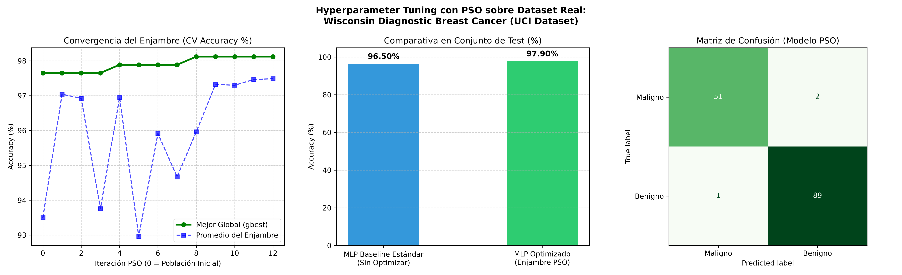
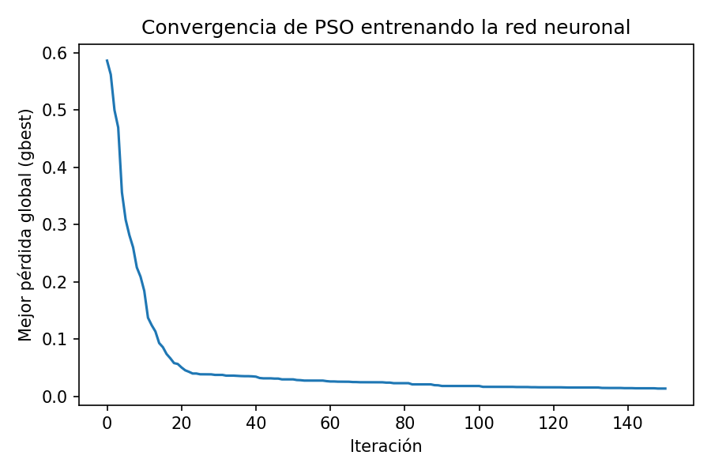
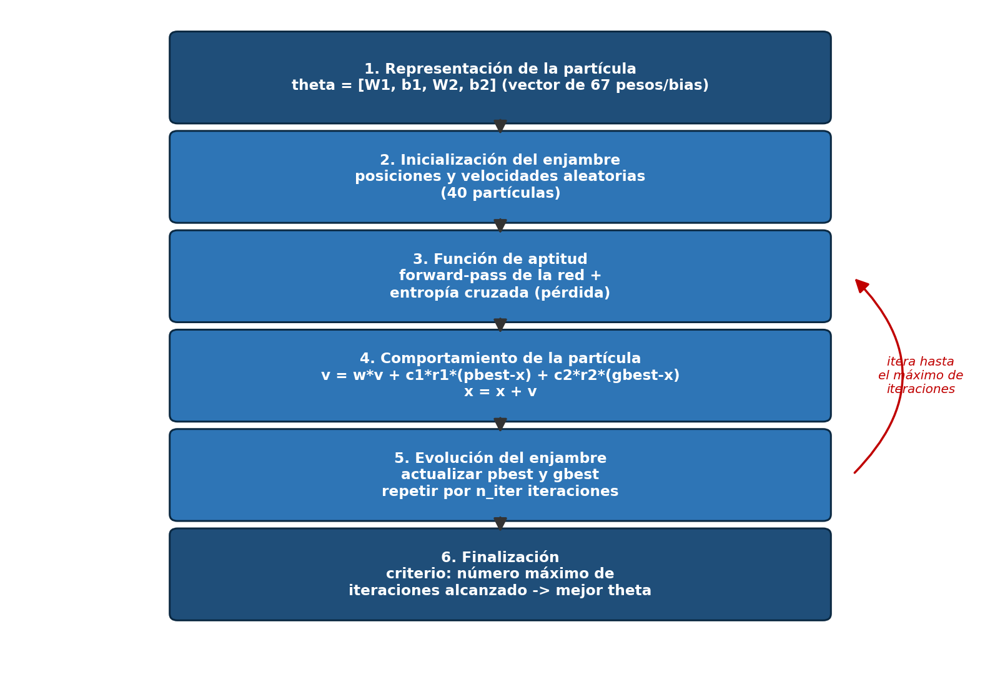
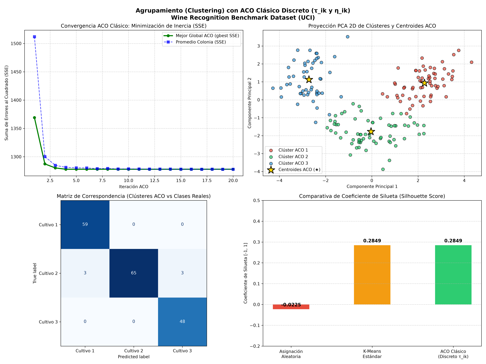
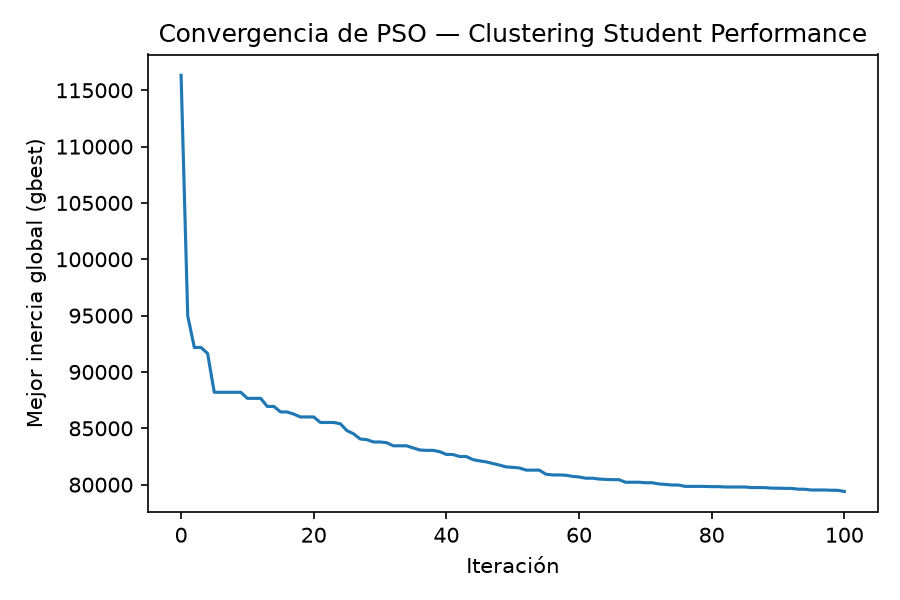

# Algoritmos de Enjambre en el Aprendizaje Automático

Este repositorio reúne la implementación, experimentación y análisis comparativo de **algoritmos de inteligencia de enjambre** (*Swarm Intelligence*) aplicados a cuatro tareas clave del aprendizaje automático (*Machine Learning*):

1. 🐝 **Selección de Características (*Feature Selection*)** mediante Colonia de Abejas Artificiales (**ABC**).
2. 🎯 **Optimización de Hiperparámetros (*Hyperparameter Tuning*)** mediante Enjambre de Partículas (**PSO**).
3. 🧠 **Entrenamiento de Redes Neuronales sin *Backpropagation*** mediante **PSO**.
4. 🐜 **Agrupamiento (*Clustering* No Supervisado)** mediante Colonia de Hormigas (**ACO**) y Enjambre de Partículas (**PSO**).

---

## 📋 Tabla de Contenidos

- [1. Selección de Características (Feature Selection) con ABC](#1-selección-de-características-feature-selection-con-abc)
- [2. Optimización de Hiperparámetros (Hyperparameter Tuning) con PSO](#2-optimización-de-hiperparámetros-hyperparameter-tuning-con-pso)
- [3. Entrenamiento de Redes Neuronales sin Backpropagation con PSO](#3-entrenamiento-de-redes-neuronales-sin-backpropagation-con-pso)
- [4. Agrupamiento (Clustering) con Algoritmos de Enjambre (ACO y PSO)](#4-agrupamiento-clustering-con-algoritmos-de-enjambre-aco-y-pso)
- [5. Resumen Completo de Archivos y Recursos](#5-resumen-completo-de-archivos-y-recursos)
- [6. Instrucciones de Instalación y Ejecución](#6-instrucciones-de-instalación-y-ejecución)

---

## 1. Selección de Características (Feature Selection) con ABC

- **Script Principal**: [`abc_feature_selection.py`](file:///home/roger/Documents/Git/Algoritmos-de-enjambre-en-el-aprendizaje-autom-tico./abc_feature_selection.py)
- **Algoritmo de Enjambre**: Colonia de Abejas Artificiales (*Artificial Bee Colony* - **ABC**)
- **Modelo Evaluador**: Red Neuronal Multicapa (`MLPClassifier`)
- **Dataset**: *Student Performance Factors*

### Descripción del Algoritmo y Flujo de Trabajo

Se implementa el algoritmo **ABC** aplicado a la selección de características para optimizar la precisión de clasificación reduciendo simultáneamente la dimensionalidad de entrada.

#### 1. Representación del Problema
- **Vector de Solución**: Cada solución se representa mediante una cadena binaria de 19 posiciones (correspondiente a las 19 variables predictoras):
  - `1`: La característica es seleccionada.
  - `0`: La característica es descartada.
- **Función Clave**: `generar_solucion()` crea cadenas aleatorias asegurando que al menos una característica sea seleccionada.

#### 2. Función de Fitness (Evaluación)
Las soluciones se evalúan entrenando un `MLPClassifier` únicamente con las características seleccionadas (`1`s). La función de **Fitness** penaliza la cantidad de variables seleccionadas para promover modelos parsimoniosos:

$$\text{Fitness} = \text{Accuracy} - \left(\lambda \times \frac{\text{Características Seleccionadas}}{\text{Total Características}}\right)$$

- **Función Clave**: `evaluar_solucion()` calcula el *accuracy*, el número de variables y el *fitness* final.

#### Fases del Algoritmo ABC

1. **Abejas Empleadas (Obreras):**
   - Cada abeja explora la vecindad comparando su solución actual con otra aleatoria mediante `generar_candidata()`.
   - Modifica posiciones donde difieren ambas cadenas.
   - Acepta la nueva candidata **únicamente si su Fitness es superior** a la solución actual.

2. **Abejas Observadoras:**
   - Evalúan la calidad de las soluciones existentes y seleccionan cuál explorar utilizando una distribución de probabilidad basada en el *Fitness* (`np.random.choice`).
   - Generan candidatas locales y aplican selección codiciosa (*greedy selection*).

3. **Abejas Exploradoras (Scouts):**
   - Se lleva un control de intentos fallidos sin mejora (`contadores_sin_mejora`).
   - Si una solución no presenta mejoras tras superar el umbral fijado (`LIMIT = 5`), la solución se abandona.
   - La abeja scout re-inicializa una nueva solución totalmente aleatoria mediante `generar_solucion()` para evitar máximos locales.

#### Parámetros Principales

| Parámetro | Valor | Descripción |
| :--- | :--- | :--- |
| `NUM_BEES` | `10` | Número de abejas en la colonia. |
| `MAX_ITERATIONS` | `20` | Iteraciones máximas de búsqueda. |
| `LIMIT` | `5` | Límite de intentos sin mejora antes de activar la abeja exploradora. |
| $\lambda$ | `0.10` | Factor de penalización por número de características utilizadas. |

---

## 2. Optimización de Hiperparámetros (Hyperparameter Tuning) con PSO

- **Script Principal**: [`pso_hyperparameter_tuning.py`](file:///home/roger/Documents/Git/Algoritmos-de-enjambre-en-el-aprendizaje-autom-tico./pso_hyperparameter_tuning.py)
- **Algoritmo de Enjambre**: Optimización por Enjambre de Partículas (*Particle Swarm Optimization* - **PSO**)
- **Modelo**: Red Neuronal Perceptrón Multicapa (`MLPClassifier`)
- **Dataset**: *Breast Cancer Wisconsin Benchmark*

### Descripción del Algoritmo y Espacio de Búsqueda

Se utiliza **PSO** para realizar el ajuste y búsqueda automática de hiperparámetros (*Hyperparameter Tuning*) optimizando la exactitud obtenida mediante **Validación Cruzada de 5 pliegues** (*5-Fold CV*).

El enjambre navega en un espacio multidimensional mixto (continuo y discreto):

1. **Capas Ocultas**: Neuronas en capa 1 ($h_1 \in [16, 128]$) y capa 2 ($h_2 \in [0, 64]$).
2. **Función de Activación**: Selección entre `relu`, `tanh`, `logistic`.
3. **Optimizador (Solver)**: Selección entre `adam`, `sgd`.
4. **Tasa de Aprendizaje Inicial ($lr$)**: Búsqueda logarítmica en el rango $\left[10^{-4}, 10^{-1}\right]$.
5. **Regularización $L_2$ ($\alpha$)**: Búsqueda logarítmica en el rango $\left[10^{-5}, 10^{-1}\right]$.

#### Gráficos Generados



---

## 3. Entrenamiento de Redes Neuronales sin Backpropagation con PSO

- **Script Principal**: [`pso_nn_training.py`](file:///home/roger/Documents/Git/Algoritmos-de-enjambre-en-el-aprendizaje-autom-tico./pso_nn_training.py)
- **Algoritmo de Enjambre**: *Particle Swarm Optimization* (**PSO**)
- **Datasets**: *Iris Dataset* y *Student Performance*

### 1. Entrenamiento de Red Neuronal mediante PSO (Dataset Iris)

Se implementó PSO para entrenar una red neuronal de 3 capas sin utilizar *backpropagation* ni cálculo de gradientes.

- **Arquitectura de la Red**:
  - Capa de entrada: 4 neuronas.
  - Capa oculta: 8 neuronas con función de activación ReLU.
  - Capa de salida: 3 neuronas con Softmax.
  - **Total de Parámetros**: 67 parámetros entre pesos ($W_1, W_2$) y bias ($b_1, b_2$).

Cada partícula del enjambre representa una configuración completa de los 67 pesos y bias. La función de aptitud utilizada es la entropía cruzada (*Cross-Entropy Loss*).

During the process, PSO updates particles using their personal best position ($p_{best}$) and the global best position found by the swarm ($g_{best}$).

#### Resultados en Iris:
- Exactitud en entrenamiento: **100 %**
- Exactitud en prueba: **94.74 %** (36 de 38 muestras correctas).

Esto demuestra que PSO puede encontrar los pesos y bias de una red neuronal sin utilizar retropropagación del gradiente.

### 2. Aplicación sobre Student Performance (Regresión)

Posteriormente se aplicó el mismo enfoque al dataset *Student Performance* para problemas de regresión (predicción de `Exam_Score`).

- **Función de Aptitud**: Error Cuadrático Medio (MSE).
- **Preprocesamiento**: Estandarización de variables numéricas y *One-Hot Encoding* para variables categóricas.

#### Gráficos Generados

| Convergencia del Entrenamiento en Iris | Ciclo de Entrenamiento de la Red |
| :---: | :---: |
|  |  |

---

## 4. Agrupamiento (Clustering) con Algoritmos de Enjambre (ACO y PSO)

Se aplican algoritmos de enjambre a la tarea de agrupamiento (*Clustering*) no supervisado para hallar la distribución natural de grupos en los datos.

### A. Clustering con Colonia de Hormigas (ACO)

- **Script Principal**: [`aco_clustering.py`](file:///home/roger/Documents/Git/Algoritmos-de-enjambre-en-el-aprendizaje-autom-tico./aco_clustering.py)
- **Algoritmo**: Optimización por Colonia de Hormigas (*Ant Colony Optimization* - **ACO Discreto**)
- **Dataset**: *Wine Recognition Dataset* ($K=3$ clústeres)

Las hormigas depositan feromonas $\tau_{i,k}$ en la matriz de asignación muestra-clúster ($N \times K$). La decisión de asignación probabilística combina la intensidad de feromona y la deseabilidad heurística $\eta_{i,k}$ (inversa de la distancia Euclídea a los centroides):

$$P(i \to k) \propto \tau_{i,k}^\alpha \times \eta_{i,k}^\beta$$

- **Evaporación y Depósito**: Se evapora la feromona con tasa $\rho = 0.1$ y se deposita feromona adicional proporcional a $Q / \text{SSE}$.

#### Gráfico de Resultados ACO



---

### B. Clustering con Enjambre de Partículas (PSO)

- **Script Principal**: [`pso_clustering.py`](file:///home/roger/Documents/Git/Algoritmos-de-enjambre-en-el-aprendizaje-autom-tico./pso_clustering.py)
- **Algoritmo**: *Particle Swarm Optimization* (**PSO**)
- **Dataset**: *Student Performance Factors*

Cada partícula en el enjambre representa un conjunto completo de $K=3$ centroides en el espacio multidimensional.

- **Configuración**: 30 partículas, 100 iteraciones.
- **Función de Aptitud**: Inercia (suma de distancias cuadráticas al centroide más cercano - SSE).
- **Resultados de Interpretación de Grupos (`Exam_Score`)**:
  - Cluster 0: promedio de `Exam_Score` = 66.86
  - Cluster 1: promedio de `Exam_Score` = 67.06
  - Cluster 2: promedio de `Exam_Score` = 67.78

Se incluye comparación gráfica directa con K-Means estándar y visualización en 2D mediante PCA.

#### Gráficos Generados



---

## 5. Resumen Completo de Archivos y Recursos

| Archivo / Recurso | Algoritmo | Descripción / Tarea |
| :--- | :--- | :--- |
| [`abc_feature_selection.py`](file:///home/roger/Documents/Git/Algoritmos-de-enjambre-en-el-aprendizaje-autom-tico./abc_feature_selection.py) | **ABC** | Selección de características en `MLPClassifier` (*Student Performance*) |
| [`pso_hyperparameter_tuning.py`](file:///home/roger/Documents/Git/Algoritmos-de-enjambre-en-el-aprendizaje-autom-tico./pso_hyperparameter_tuning.py) | **PSO** | Búsqueda y ajuste automático de hiperparámetros (*Breast Cancer*) |
| [`pso_nn_training.py`](file:///home/roger/Documents/Git/Algoritmos-de-enjambre-en-el-aprendizaje-autom-tico./pso_nn_training.py) | **PSO** | Entrenamiento de pesos y bias de Red Neuronal de 3 capas sin Backpropagation |
| [`aco_clustering.py`](file:///home/roger/Documents/Git/Algoritmos-de-enjambre-en-el-aprendizaje-autom-tico./aco_clustering.py) | **ACO** | Clustering discreto mediante feromonas y heurística de distancias (*Wine*) |
| [`pso_clustering.py`](file:///home/roger/Documents/Git/Algoritmos-de-enjambre-en-el-aprendizaje-autom-tico./pso_clustering.py) | **PSO** | Clustering continuo optimizando las posiciones de los centroides |
| `pso_tuning_results.png` | - | Gráfica de evolución y resultados de tuning de hiperparámetros con PSO |
| `aco_clustering_results.png` | - | Gráficas comparativas de clustering ACO vs K-Means y Random |
| `convergencia_pso.png` | - | Curva de convergencia de pérdida PSO en dataset Iris |
| `ciclo_pso_nn.png` | - | Diagrama de flujo del ciclo iterativo PSO para entrenamiento de redes |
| `convergencia_pso_clustering.png` | - | Curva de disminución de inercia (SSE) en PSO Clustering |
| `evolucion_aco_clustering.csv` | - | Registro de inercia y silueta por iteración en ACO Clustering |
| `evolucion_pso.csv` | - | Registro de convergencia por iteración en PSO Hyperparameter Tuning |

---

## 6. Instrucciones de Instalación y Ejecución

### 1. Crear, Activar el Entorno Virtual e Instalar Requerimientos

```bash
# 1. Crear el entorno virtual
python3 -m venv .venv

# 2. Activar el entorno virtual
source .venv/bin/activate

# 3. Instalar dependencias requeridas
pip install -r requirements.txt
```

### 2. Ejecución de Experimentos

```bash
# 1. Selección de características con ABC
python abc_feature_selection.py

# 2. Ajuste de hiperparámetros con PSO
python pso_hyperparameter_tuning.py

# 3. Entrenamiento de Red Neuronal sin Backpropagation con PSO
python pso_nn_training.py

# 4. Clustering con ACO (Hormigas)
python aco_clustering.py

# 5. Clustering con PSO (Partículas)
python pso_clustering.py
```


